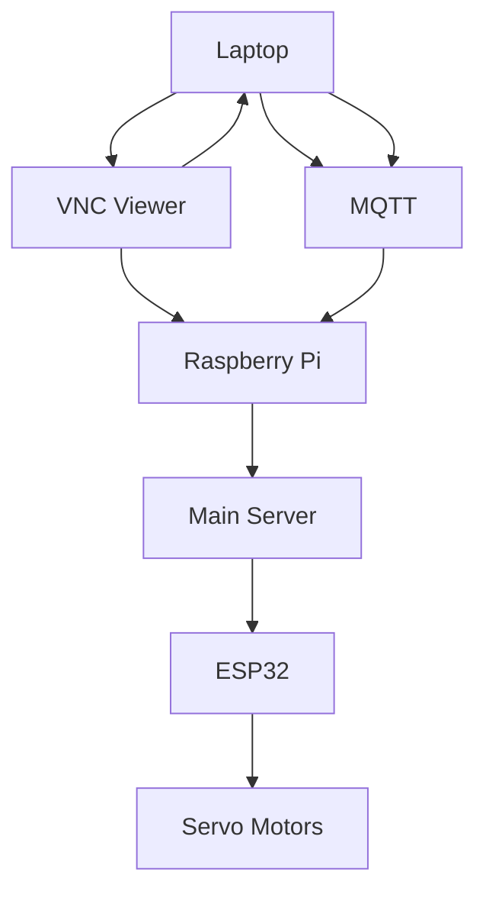
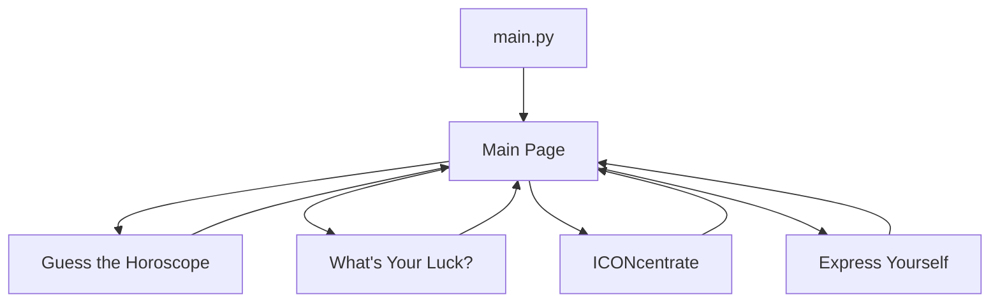
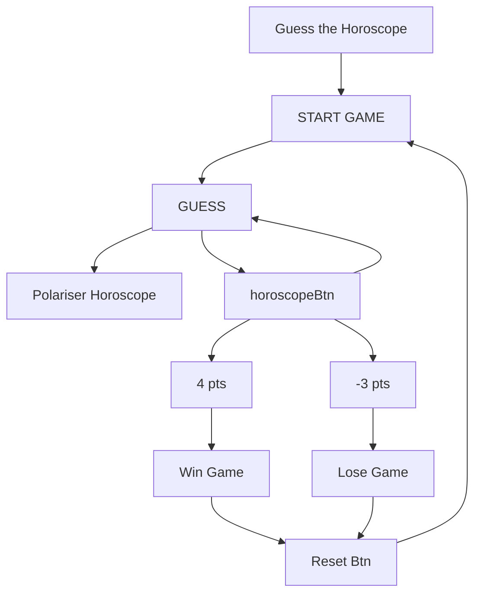
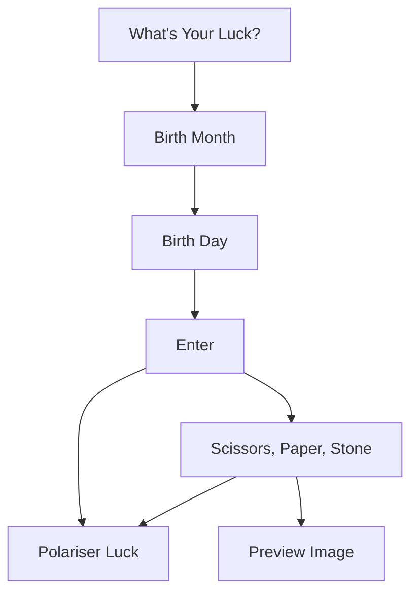
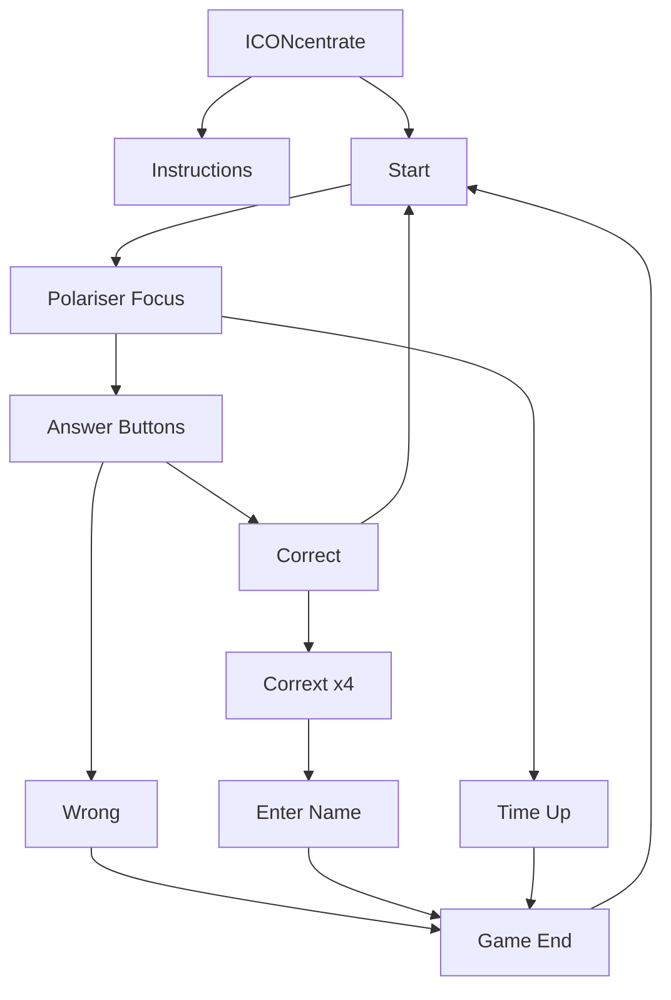
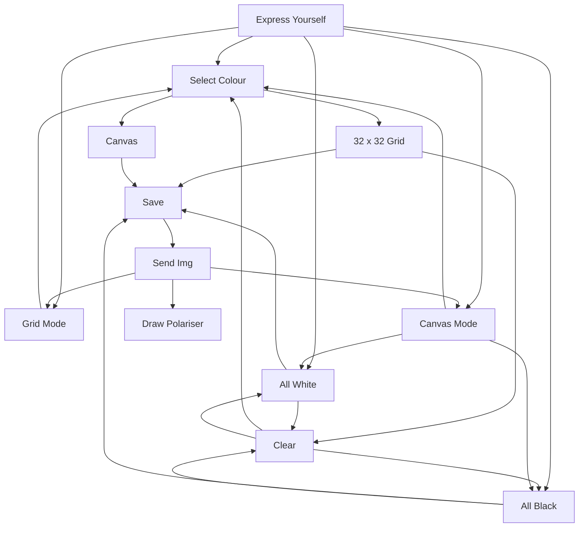

# **Mental Wellness GUI**

The Mental Wellness GUI approaches different ways to improve one's positive state of mind. There are 4 available games which are of different ways where one could approach mental wellness. The games also leverages on electromechanical systems that manipulate polarization to synergize pixelized art forms. 


<br>


<br>
*Mental Wellness GUI Main Page*

<br>

# **Features**

The Mental Wellness GUI provides the following features:

- <a href="https://github.com/tlwl19/EGL314#guess-the-horoscope">Guess the Horoscope</a>
- <a href="https://github.com/tlwl19/EGL314#whats-your-luck">What's Your Luck?</a>
- <a href="https://github.com/tlwl19/EGL314#iconcentrate">Test Your Concentration</a>
- <a href="https://github.com/tlwl19/EGL314#express-yourself">Express Yourself</a>

Upon clicking on any of the buttons they will be directed to each respective game, where more details will be given.

<br>

# **System Diagram**

## **Hardware**


<a href="https://github.com/huats-club/EGL314starterkit"><i>Fu Yongwei, huats-club/EGL314starterkit</i></a>

<br>

## **Software**


*Software Flow Chart*

<br>

## **Guess the Horoscope**

*Guess the Horoscope Flow Chart*

<br>

## **What's your Luck?**

*What's the Luck Flow Chart*

<br>

## **ICONcentrate**


*ICONcentrate Flow Chart*

<br>

## **Express Yourself**

*Express Yourself Flow Chart*

<br>

# **Getting Started**

## **Hardware** 
1. Single Board Computer: Raspberry Pi 4 Model B
2. Operating System: Raspbian Buster Full


*Fu YongWei, EGL314, Lecture notes 1*

<br>

## **Software** 
1. PuTTY 
2. VNC Viewer
3. Python

<br>

## **Tutorial**

For more details on installation of your software, refer to the following:
- <a href="https://github.com/tlwl19/finalchallenge#installation">Software Installation steps</a>

Before we begin coding, we will need to install certain libraries that will be used for this project.

Some of the libraries that we will be using are:

- <a href="https://pillow.readthedocs.io/en/stable/installation.html">Pillow</a>
- <a href="https://www.tutorialspoint.com/how-to-install-tkinter-in-python">Tkinter</a>

The other libraries needed should already be installed within Python.

<br>

### **Import libraries**

Firstly, we will need to import all of the necessary libraries to `main.py`. These are the libraries that we used throughout the 4 games.
```
from tkinter import *
from tkinter.font import Font
import os
import random
from PIL import Image, ImageTk, ImageOps
from datetime import datetime
from tkinter import messagebox, simpledialog
from tkinter import ttk
import cartoon
from student_pub import *
```

<br>

#### **Import libraries for Guess the Horoscope**
These are the libraries that we need to import in order to run `guess.py`
```
from tkinter import *
import random
import os 
from PIL import Image, ImageTk, ImageOps
from PIL import ImageDraw
import cartoon
```

<br>

#### **Import libraries for What's Your Luck?**
These are the libraries that we need to import in order to run `luck.py`
```
from tkinter import *
import random
import os 
from datetime import *
from PIL import Image, ImageTk, ImageOps
import cartoon
```

<br>

#### **Import libraries for ICONcentrate**
These are the libraries that we need to import in order to run `focus.py`
```
from tkinter import *
import random
from datetime import datetime
from PIL import Image, ImageTk
from tkinter import messagebox, simpledialog
import cartoon
```

<br>

#### **Import libraries for Express Yourself**
These are the libraries that we need to import in order to run `draw.py`
```
from tkinter import *
from tkinter import ttk
import cartoon
```

<br>

Next, we will need to create a main GUI window. Here, we changed the title to 'Mental Wellness'. You can change the title to your preference.
```
main = Tk()
main.title("Mental Wellness")
```

<br>

For the window to stay, we will need to loop it.
```
main.mainloop()
```

<br>

<font size = "3">Output</font>


<br>
*Main GUI Window*

<br>

---

# **Home Page** 

In the home page, there are 4 navigation buttons that the user can use to navigate to each respective game. The 4 games that the user can play are: "Guess the Horoscope", "What's Your Luck", "ICONcentrate", and lastly, "Express Yourself".  
<br>


*GUI Main Page*

<br>

---

# **Guess the Horoscope**

Let's begin with the "Guess the Horoscope" game.
<br>
The main objective of this game is to challenge the user's short-term memory skills and determine if the user has good memory by getting 4 correct horoscope guesses.

<br>

## How The Game Works

From the home page, click on the "Guess the Horoscope" button.


*From Home page navigate to "Guess the Horoscope" page*

<br>

You will be redirected to the "Guess the Horoscope" page.
<br>


*Guess the Horoscope page*

<br>

Click on "Start Game" to begin


*Press 'Start Game' to play*

<br>

Once the game has started, all the images of the horosopes on the grid on the left side of the window will disappear, and will only display their respective names.


*Game has started*

<br>

The polariser board will generate a random horoscope image. You have to guess the horoscope that is shown on the polariser.


*Image has been sent over to the polariser*

<br>

For example, if the polariser shows Cancer, click on the Cancer button on the GUI.


*Click on the correct button*

<br>

If you have chosen the correct horocsope, your answer will be lighlighted green and you gain a point.


*Correct answer*

<br>

However, if you have chosen the wrong horoscope, your answer will be highlighted red and you lose a point.


*Wrong answer*

<br>

You can continue guessing until you get the correct answer


*Keep trying until you get it*

<br>

If you acheive a score of 4, 'YOU WIN' will appear and the game will end.


*Win the game with a maximum of 4 points*

<br>

You can click on the Reset Game button to start over.


*Reset game*

<br>

You can click on the "Fun Ways to Approach MENTAL WELLNESS" navigation button on the top of the window to return to the home page. Or you can click on the bottom navigation button to play other games.


*Navigate to home or other games page*

<br>

---

# **What's Your Luck?**

Next, we will proceed on with "What's Your Luck?" game.
<br>
The luck game gives the user a surge of dopamine and it plays a part in controlling the movement a person makes, as well as their emotional response.

<br>

## How The Game Works

From the home page, click on the "What's Your Luck?" button.


*From home page navigate to "What's your luck?" page*

<br>

You will then be redirected to the "What's Your Luck?" page.


*What's Your Luck? page*

<br>

On this page, you can insert your date of birth, and it will generate a random luck percentage on the polariser. 


*Select your birth month*

<br>


*Select your birth date*

<br>

The luck percentages are as follows:
- Genie Lamp
    - 50%
- 75% Luck
- 99% Luck

<br>

If the polariser displays genie lamp, it means your luck is 50%. You can choose to try again by entering another date of birth.


*Genie lamp shown on polariser*

Your UI will also display a random quote.

*If you get a genie lamp on the polarizer, your UI will display a quote*

<br>

However, if the polariser displays 75% or 99% luck, the game will prompt you to play a game of rock, paper, scissors.


*75% luck or higher*

<br>


*Play rock, paper, scissors*

<br>

Once you have select either rock, paper or scissors, it will be displayed on the preview window.


*Preview of rock, paper, scissors that you have choosen*

<br>

The game will generate rock, paper or scissors on the polariser. That will determine if you win or lose.


*Either rock, paper or scissors will be shown on the polariser*

<br>

The game will end after playing rock, paper, scissors. You can choose to play again by entering another date of birth or click on the "Fun Ways to Approach MENTAL WELLNESS" navigation button on the top of the window to return to the home page. Or you can click on the bottom navigation buttons to play other games.


*Navigate to home or other games page*

<br>

---

# **ICONcentrate**

ICONcentrate is a game that trains the user's callback memory. It is also built to test your concentration by seeing how fast you can react to guessing common brands that we see in our daily lives.

<br>

## How The Game Works

From the home page, click on the "Test Your Concentration" button.


*From home page navigate to "ICONcentrate" page*

<br>

You will then be redirected to the ICONcentrate game page


*ICONcentrate page*

<br>

Click on the instructions button to learn how to play the game.


*Press on 'Instructions' button to read the instructions of the game*

<br>


<br>
*Instructions*

<br>

To start the game, press the start button on the right to begin.


*Press 'Start' to play the game*

<br>

Once the game has begun, a random brand icon will be displayed on the polariser board. 


*Random image icon is generated and send to polariser*

<br>

You will have 20 seconds to guess the icon from the selection of choices below. 


*Choose the correct icon corresponding to that being shown on the polariser*

<br>

Once 20 seconds has passed, the game will end.


*Time's Up*

<br>

If you guessed the wrong icon, a message box will appear to notify you that you have guessed the wrong brand and the game will end.

         
*Game ended once you guessed wrongly*

<br>

If you guessed a correct icon, you will move on to the next level, and you can click the start button to display the next icon on the polariser. A random quote will also appear below.


*Next level*

<br>

In order to beat the game, you have to guess the correct icon through 4 levels, with each level progressing with higher difficulty where lesser-known brands are displayed or where some brand icons are harder to distinguish. You only have one attempt.


*Final level*

<br>

Once you have beaten all 4 levels, you will be prompted to enter your name


*Enter your name*

<br>

Once you have entered your name, a messaage box with your name will appear to notify you that you have beaten the game and the time taken to beat the game.


*Total time taken to complete the game*

<br>

You can click on the "Fun Ways to Approach MENTAL WELLNESS" navigation button on the top of the window to return to the home page. Or you can click on the bottom navigation button to play other games.


*Navigate to home or other games page*

<br>

---

# **Express Yourself**

The main objective of this game is to help user express their feelings through drawing. As some people may be afraid to voice out their inner thoughts, instead they can draw it out.

<br>

## Let's see how to play this game

From the home page, click on the "Express Yourself" button.


*From home page navigate to "Express Yourself" page*

<br>

You will be redirected to the "Express Yourself" page.


*Express Yourself page*

<br>

The game features a grid consisting of 32 x 32 pixels. You can change the colour of each pixel by clicking on the available shades of black on the right. 


*Select the colour that you want to use*

<br>

Next, click on the 32 x 32 pixel and change the colour of the grid. You can also select the grid and draw something out.


*Click on the respective pixels on the grid to change their respective colours*

<br>

Alternatively, you can also paint the grid by changing to the draw mode located on the top left hand corner of the grid.


*Change to draw mode*

<br>

Once you have changed to draw mode, the grid will be changed into a canvas.


*Draw mode will show canvas*

<br>

You can choose any shades of black that is on the right and begin to draw on the canvas.


*I am the modern day Picasso*

<br>

Once you are done drawing, you can convert your drawing into a pixelised form on the grid. In order to do that, we will have to save the drawing.


*Save drawing on canvas*

<br>

Once you have saved the drawing, it will be pixelised in the grid mode. If you want to see your pixelised drawing, you can change back to the grid form by clicking the grid button on the top left hand corner of the cavnvas.


*Change to grid mode to see pixelised form*

<br>

And voilà! You have successfully converted your drawing into a pixelised form.


*Pixelised form on grid*

<br>

You can send your pixelised drawing to the polariser by clicking on the 'Send Image' button and it will display your pixelised drawing.


*Click on 'Send Image' to see pixelised form on the polariser*

<br>


*Final outcome on the polariser*

<br>

### Additional Features: Express Yourself
<br>

1. All White
<br>

Click on the 'All White' button to turn the entire grid and canvas to white.


*Change the grid and canvas to white*

<br>


*All White on grid*

<br>


*All White on canvas*

<br>

2. All Black
<br>

Turns the entire grid and canvas to black. This can be extremely helpful if you want to draw with lighter shades such as white colour to Grey 3.

<br>

Click on the 'All Black' button to turn the entire grid and canvas to black.


*Change the grid and canvas to black*

<br>


*All Black on grid*

<br>


*All Black on canvas*

<br>

If you want to clear your canvas or grid, you can press the clear button.


*Clear everything that is drawn either on grid or canvas*

<br>


*Clear everything that is drawn either on grid or canvas*

<br>

---

# **Creating the Overall GUI**

## **Overall frame structure**


*Frame structure*

<br>

Header frame:

To be used for the top of the window
```
topframe = Frame(main)
topframe.grid(row=0, column=0)
```
<br>

Feature frame:

To be used for the middle of the window
```
middleframe = Frame(main)
middleframe.grid(row=1, column=0)
```
<br>

Footer frame:

To be used at the bottom of the window
```
modeframe = Frame(main)
modeframe.grid(row=2, column=0)
```

<br>

## **Home button in every page**

<br>


<br>

To create the big "Fun Ways to Approach MENTAL WELLNESS"  button on the top of the window. Once user pressed on the button, it will bring them back to their home page.

```
headertitle = Button(topframe, text="Fun Ways to Approach MENTAL WELLNESS", font=header_font, fg = '#6495ED', activeforeground='#C3B1E1', command=mainappear, padx=250)
headertitle.grid(row=0, column=0)
```

<br>

## **Creating the main page**
---

<br>


*Main Page GUI*

<br>

### **Creating the Functions Used**
**Main Page Function:**
<br>

To navigate to Main Page :
```
def mainappear(): 
    guessframe.grid_forget()
    focusframe.grid_forget()
    luckframe.grid_forget()
    drawingframe.grid_forget()
    mainframe.grid(row=0, column=0)
```

Creating own font for header and quote :
```
header_font = Font(
    family = 'Times', 
    size = 30,
    weight = 'bold',
    slant = 'roman',
)

quote_font = Font(
    family = 'Typewriter', 
    size = 15,
    weight = 'bold',
    slant = 'roman',
)
```

### **Creating the Layout**
**Main Page Frame:**
<br>

We will be displaying our definition of mental wellness on this frame.
```
mainframe = Frame(middleframe)
mainframe.grid(row=0, column=0)
```

<br>

Quote & Description :
```
quotevar = "Mental Health.. is not a destination, but a process. It's about how you drive, not where you're going.\n \n-NOAM SHPANCER, PHD"
quote = Label(mainframe, text=quotevar, font=quote_font, bg='#DBDBDB', padx=50 ,pady=50)
quote.grid(row=0, column=0)

descvar = "Mental Wellness is an internal resource that helps us THINK, FEEL, CONNECT, and FUNCTION."
desc = Label(mainframe, text=descvar, font=('Arial', 20), pady=25) 
desc.grid(row=1, column=0)
```

<br>

Image :
```
mentalpath = "wellness/mental.jpg"
myImage = Image.open(mentalpath)
mentalImage = ImageTk.PhotoImage(myImage)
mentalpic = Label(mainframe, image=mentalImage)
mentalpic.grid(row=2, column=0)
```

<br>

## **Creating Guess the Horoscope**
---

<br>


*Guess the Horoscope page*

<br>

### **Creating the Functions Used**
<br>

**Guess the Horoscope Function:**

<br>

To send images in the game to the polariser:
```
def show_Image_guess(choice1):
    path2 = "horo/" + str(choice1) + ".png"
    myImage = Image.open(path2)
    cartoon.pixelised(path = path2)
    myImage = Image.open("cartoon.png")

```

<br>

To start the game :
```
def startgame():
    global score, prevent, number, prevent2
    prevent = []
    widthx = 15
    heightx = 8
    if number == 15:
        score = 0
        btn0.config(bg='#C3B1E1', fg="black", image='', width=widthx, height=heightx)
        btn1.config(bg='#C3B1E1', fg="black", image='', width=widthx, height=heightx) 
        btn2.config(bg='#C3B1E1', fg="black", image='', width=widthx, height=heightx)
        btn3.config(bg='#C3B1E1', fg="black", image='', width=widthx, height=heightx) 
        btn4.config(bg='#C3B1E1', fg="black", image='', width=widthx, height=heightx) 
        btn5.config(bg='#C3B1E1', fg="black", image='', width=widthx, height=heightx) 
        btn6.config(bg='#C3B1E1', fg="black", image='', width=widthx, height=heightx) 
        btn7.config(bg='#C3B1E1', fg="black", image='', width=widthx, height=heightx) 
        btn8.config(bg='#C3B1E1', fg="black", image='', width=widthx, height=heightx) 
        btn9.config(bg='#C3B1E1', fg="black", image='', width=widthx, height=heightx) 
        btn10.config(bg='#C3B1E1', fg="black", image='', width=widthx, height=heightx) 
        btn11.config(bg='#C3B1E1', fg="black", image='', width=widthx, height=heightx) 
        scoreresults.config(text=str(score),font=('Arial',20))
        number = 12 
        guess()
        lbl0.grid_forget()
        lbl1.grid_forget()
        lbl2.grid_forget()
        lbl3.grid_forget()
        lbl4.grid_forget()
        lbl5.grid_forget()
        lbl6.grid_forget()
        lbl7.grid_forget()
        lbl8.grid_forget()
        lbl9.grid_forget()
        lbl10.grid_forget()
        lbl11.grid_forget()
        startbtn['state']='disabled'
    elif number == 18:
        youwin.config(text="Press any button to continue ", font=('Arial',10))
        youwin.grid(row=4, column=2)

```

<br>

To reset game :
```
def restartgame():
    global score, prevent, number, prevent2
    prevent = []  
    widthx = 184
    heightx = 196
    if number == 13 or number == 14 or number == 17 or number == 18:
        for i in range(0, 12):
            paths = "horo/" + str(i) + ".png"
            myImages = Image.open(paths)
            myImages = myImages.resize((90, 90))
            loadImages = ImageTk.PhotoImage(myImages)
            widthy = 114
            heighty = 126
            if i == 0:
                btn0.image = loadImages
                btn0.config(image = loadImages, width=widthy, height=heighty, bg='white')
            elif i == 1:
                btn1.image = loadImages
                btn1.config(image = loadImages, width=widthy, height=heighty, bg='white')
            elif i == 2:
                btn2.image = loadImages
                btn2.config(image = loadImages, width=widthy, height=heighty, bg='white')
            elif i == 3:
                btn3.image = loadImages
                btn3.config(image = loadImages, width=widthy, height=heighty, bg='white')
            elif i == 4:
                btn4.image = loadImages
                btn4.config(image = loadImages, width=widthy, height=heighty, bg='white')
            elif i == 5:
                btn5.image = loadImages
                btn5.config(image = loadImages, width=widthy, height=heighty, bg='white')
            elif i == 6:
                btn6.image = loadImages
                btn6.config(image = loadImages, width=widthy, height=heighty, bg='white')
            elif i == 7:
                btn7.image = loadImages
                btn7.config(image = loadImages, width=widthy, height=heighty, bg='white')
            elif i == 8:
                btn8.image = loadImages
                btn8.config(image = loadImages, width=widthy, height=heighty, bg='white')
            elif i == 9:
                btn9.image = loadImages
                btn9.config(image = loadImages, width=widthy, height=heighty, bg='white')
            elif i == 10:
                btn10.image = loadImages
                btn10.config(image = loadImages, width=widthy, height=heighty, bg='white')
            else:
                btn11.image = loadImages
                btn11.config(image = loadImages, width=widthy, height=heighty, bg='white')
        scoreresults.config(text="Press Start Game to Start",font=('Arial',12)) 
        number = 15
        startbtn['state']='normal'
        youwin.grid_forget()
        btn0.grid(row=0, column=0)
        lbl0.grid(row=1, column=0)
        btn1.grid(row=0, column=1)
        lbl1.grid(row=1, column=1)
        btn2.grid(row=0, column=2)
        lbl2.grid(row=1, column=2)
        btn3.grid(row=0, column=3)
        lbl3.grid(row=1, column=3)

        btn4.grid(row=2, column=0)
        lbl4.grid(row=3, column=0)
        btn5.grid(row=2, column=1)
        lbl5.grid(row=3, column=1)
        btn6.grid(row=2, column=2)
        lbl6.grid(row=3, column=2)
        btn7.grid(row=2, column=3)
        lbl7.grid(row=3, column=3)

        btn8.grid(row=4, column=0)
        lbl8.grid(row=5, column=0)
        btn9.grid(row=4, column=1)
        lbl9.grid(row=5, column=1)
        btn10.grid(row=4, column=2)
        lbl10.grid(row=5, column=2)
        btn11.grid(row=4, column=3)
        lbl11.grid(row=5, column=3)
```

<br>

For the guess button to generate a random horoscope, with no duplicates and to send it to the polariser :
```
def guess():
    global number, prevent, numberx, numberxlist, prevent2, prevent3
    prevent = []  
    prevent2 = [2]
    prevent3 = 0
    if number == 12 or number == 18:
        number = 16
        youwin.config(text="Guess the horoscope!", font=('Arial',20))
        numberx = random.randint(0,11) 
        while len(numberxlist) == 12:
            numberxlist = []
        if len(numberxlist) >= 1: 
            while numberx in numberxlist: 
                numberx = random.randint(0,11) 
            else:
                numberxlist.append(numberx)
                print(numberxlist)
                show_Image(numberx)
        else:
            numberxlist = [numberx]
            print(numberxlist)
            show_Image(numberx)
        btn0.config(bg='#C3B1E1', fg="black")
        btn1.config(bg='#C3B1E1', fg="black") 
        btn2.config(bg='#C3B1E1', fg="black") 
        btn3.config(bg='#C3B1E1', fg="black") 
        btn4.config(bg='#C3B1E1', fg="black") 
        btn5.config(bg='#C3B1E1', fg="black") 
        btn6.config(bg='#C3B1E1', fg="black") 
        btn7.config(bg='#C3B1E1', fg="black") 
        btn8.config(bg='#C3B1E1', fg="black") 
        btn9.config(bg='#C3B1E1', fg="black") 
        btn10.config(bg='#C3B1E1', fg="black")
        btn11.config(bg='#C3B1E1', fg="black") 
    elif number == 13 or number == 17 or number == 14:
        youwin.config(text="Press Reset Game to Reset", font=('Arial',20))
    elif number == 15: 
        youwin.config(text="Press Start Game to Start", font=('Arial',20))
    else:
        youwin.config(text="Select one horoscope!", font=('Arial',20))
```

<br>

To check if the game has started and if it has started, it needs to check if player choice is correct and will indicate if the player has guessed correctly or not. If the game has not started or the game has already ended, it will prompt the player to reset and start the game again.
```
def horobutton(c): 
    global number, score, prevent, numberx, prevent2, quoteno, quotelist, prevent3
    quotelist = ["'You don’t have to control your thoughts. You just have to stop letting them control you.' — Dan Millman",
     "'There is a crack in everything, that’s how the light gets in.' ― Leonard Cohen",
     "'Deep breathing is our nervous system’s love language.' — Dr. Lauren Fogel Mersy",
     "'You are not your illness. You have an individual story to tell. You have a name, a history, a personality. Staying yourself is part of the battle.' — Julian Seifter",
     "'Happiness can be found even in the darkest of times, if one only remembers to turn on the light.' — Albus Dumbledore",
     "'Vulnerability sounds like truth and feels like courage. Truth and courage aren’t always comfortable, but they're never weakness.' — Brené Brown",
     "'Promise me you’ll always remember: You’re braver than you believe, and stronger than you seem, and smarter than you think.' — Christopher Robin from Winnie the Pooh",
     "'Just because no one else can heal or do your inner work for you doesn’t mean you can, should, or need to do it alone.' – Lisa Olivera",
     "'There is hope, even when your brain tells you there isn’t.' — John Green",
     "'There is no normal life that is free of pain. It's the very wrestling with our problems that can be the impetus for our growth.' — Fred Rogers",
     "'You don’t have to be positive all the time. It’s perfectly okay to feel sad, angry, annoyed, frustrated, scared and anxious. Having feelings doesn’t make you a negative person. It makes you human.' — Lori Deschene",
     "'Nothing can dim the light that shines from within.' — Maya Angelou"]
   #quotelist = ['1']
    if number == 15:
        youwin.config(text="Press Start Game to Start", font=('Arial',20))
    elif number == 17: 
        youwin.config(text="Press Reset Game to Reset", font=('Arial',20))
    elif number == 14:
        scoreresults.config(text='YOU WIN', font=('Arial',20))
        youwin.config(text="Press Reset Game to Reset", font=('Arial',20))
        youwin.grid(row=4, column=2)
    elif number == 13:
        youwin.config(text="Press Start Game to Start", font=('Arial',20))

    else: 
        if c == numberx:
            if quoteno >= len(quotelist)-1:
                quoteno = -1
            quoteno=quoteno+1
            quote.config(text=quotelist[quoteno],bg='white')
            prevent2 = [0]
            if prevent == [2]:
                number = 18
                guess()
            else:
                if c == 0:
                    btn0.config(bg="#7fff00")
                elif c == 1:
                    btn1.config(bg="#7fff00")
                elif c == 2:
                    btn2.config(bg="#7fff00")
                elif c == 3:
                    btn3.config(bg="#7fff00")
                elif c == 4:
                    btn4.config(bg="#7fff00")
                elif c == 5:
                    btn5.config(bg="#7fff00")
                elif c == 6:
                    btn6.config(bg="#7fff00")
                elif c == 7:
                    btn7.config(bg="#7fff00")
                elif c == 8:
                    btn8.config(bg="#7fff00")
                elif c == 9:
                    btn9.config(bg="#7fff00")
                elif c == 10:
                    btn10.config(bg="#7fff00")
                else:
                    btn11.config(bg="#7fff00")
                score = score+1
                prevent = [2]
                number = 18
                print(prevent)
                if score >= 4:
                    scoreresults.config(text='YOU WIN', font=('Arial',20))
                    youwin.config(text="Press Reset Game to Reset", font=('Arial',12))
                    youwin.grid(row=4, column=2)
                    number = 14
                    color = '#cbc3e3'
                    btn0.config(bg=color, fg='black')
                    btn1.config(bg=color, fg='black')
                    btn2.config(bg=color, fg='black')
                    btn3.config(bg=color, fg='black')
                    btn4.config(bg=color, fg='black')
                    btn5.config(bg=color, fg='black')
                    btn6.config(bg=color, fg='black')
                    btn7.config(bg=color, fg='black')
                    btn8.config(bg=color, fg='black')
                    btn9.config(bg=color, fg='black')
                    btn10.config(bg=color, fg='black')
                    btn11.config(bg=color, fg='black')
                else:
                    scoreresults.config(text=str(score), font=('Arial',20))
                    youwin.config(text="Press any button to continue ", font=('Arial',20))
                    youwin.grid(row=4, column=2)
        else:
            if prevent3 == 0:
                if quoteno >= len(quotelist)-1:
                    quoteno = -1
                quoteno=quoteno+1
                prevent3 = 1
                quote.config(text=quotelist[quoteno],bg='white')
            if prevent2 == [0]:
                number = 18
                guess()
            else:
                if c == 0:
                    btn0.config(bg="#FF0800")
                    prevent2 = [4]
                    prevent3 = 1
                elif c == 1:
                    btn1.config(bg="#FF0800")
                    prevent2 = [4]
                    prevent3 = 1
                elif c == 2:
                    btn2.config(bg="#FF0800")
                    prevent2 = [4]
                    prevent3 = 1
                elif c == 3:
                    btn3.config(bg="#FF0800")
                    prevent2 = [4]
                    prevent3 = 1
                elif c == 4:
                    btn4.config(bg="#FF0800")
                    prevent2 = [4]
                    prevent3 = 1
                elif c == 5:
                    btn5.config(bg="#FF0800")
                    prevent2 = [4]
                    prevent3 = 1
                elif c == 6:
                    btn6.config(bg="#FF0800")
                    prevent2 = [4]
                    prevent3 = 1
                elif c == 7:
                    btn7.config(bg="#FF0800")
                    prevent2 = [4]
                    prevent3 = 1
                elif c == 8:
                    btn8.config(bg="#FF0800")
                    prevent2 = [4]
                    prevent3 = 1
                elif c == 9:
                    btn9.config(bg="#FF0800")
                    prevent2 = [4]
                    prevent3 = 1
                elif c == 10:
                    btn10.config(bg="#FF0800")
                    prevent2 = [4]
                    prevent3 = 1
                else:
                    btn11.config(bg="#FF0800")
                    prevent3 = 1
                    prevent2 = [4]

                if prevent2 == [4] or prevent3 == 1:
                    quoteno = quoteno
                    youwin.config(text="Choose another horoscope", font=('Arial',20))
            print(score)
```

<br>

To navigate to guess page :
```
def guessappear(): 
    luckframe.grid_forget()
    focusframe.grid_forget()
    mainframe.grid_forget()
    drawingframe.grid_forget()
    guessframe.grid(row=0, column=0)
```

<br>

### **Creating the Layout**
**Guess the Horoscope Frame:**
<br>

This will be the frame structure we will be using for our "Guess the Horoscope" game.
```
guessframe = Frame(middleframe)
```

<br>

We will need to create the first frame, which is for the 3x4 grid.
```
inguessframe = Frame(guessframe)
inguessframe.grid(row=1, column=0)

imageFrame = Frame(guessframe)
imageFrame.grid(row=0, column=1)
```

<br>

Next, we will create the second frame, which is for the START button, RESET button, and SCORE.
```
inguessframe2 = Frame(guessframe)
inguessframe2.grid(row=1, column=2)
```

<br>

Guess the Horoscope game title :
```
headername = Label(guessframe, text="Guess the Horoscope", font=('Arial', 40)) 
headername.grid(row=0, columnspan=3)
```

<br>

Creating Horoscope Game:

<br>

After the frames have been created, we will start to create the buttons for the horoscopes and their respective names as labels in the 3x4 grid.
```
inputrow = 6    
inputcolumn = 4

for r in range(inputrow):
    for c in range(inputcolumn):
        # Button Section
        btn0 = Button(inguessframe, text = "Aquarius", font = ("Arial", 17), bg='white', fg='black', command=lambda m=0:horobutton(m))
        lbl0 = Label(inguessframe, text="Aquarius", font=("Arial", 20), fg='black')
        btn1 = Button(inguessframe, text = "Aries", font = ("Arial", 17), bg='white', fg='black', command=lambda m=1:horobutton(m))
        lbl1 = Label(inguessframe, text="Aries", font=("Arial", 20), fg='black')
        btn2 = Button(inguessframe, text = "Cancer", font = ("Arial", 17), bg='white', fg='black',command=lambda m=2:horobutton(m))
        lbl2 = Label(inguessframe, text="Cancer", font=("Arial", 20), fg='black')
        btn3 = Button(inguessframe, text = "Capricorn", font = ("Arial", 17), bg='white', fg='black',command=lambda m=3:horobutton(m))
        lbl3 = Label(inguessframe, text="Capricorn", font=("Arial", 20), fg='black')
        btn4 = Button(inguessframe, text = "Gemini", font = ("Arial", 17), bg='white', fg='black',command=lambda m=4:horobutton(m))
        lbl4 = Label(inguessframe, text="Gemini", font=("Arial", 20), fg='black')
        btn5 = Button(inguessframe, text = "Leo", font = ("Arial", 17), bg='white', fg='black',command=lambda m=5:horobutton(m))
        lbl5 = Label(inguessframe, text="Leo", font=("Arial", 20), fg='black')
        btn6 = Button(inguessframe, text = "Libra", font = ("Arial", 17), bg='white', fg='black',command=lambda m=6:horobutton(m))
        lbl6 = Label(inguessframe, text="Libra", font=("Arial", 20), fg='black')
        btn7 = Button(inguessframe, text = "Pisces", font = ("Arial", 17), bg='white', fg='black',command=lambda m=7:horobutton(m))
        lbl7 = Label(inguessframe, text="Pisces", font=("Arial", 20),fg='black')
        btn8 = Button(inguessframe, text = "Sagittarius", font = ("Arial", 17), bg='white', fg='black',command=lambda m=8:horobutton(m))
        lbl8 = Label(inguessframe, text="Sagittarius", font=("Arial", 20), fg='black')
        btn9 = Button(inguessframe, text = "Scorpio", font = ("Arial", 17), bg='white', fg='black',command=lambda m=9:horobutton(m))
        lbl9 = Label(inguessframe, text="Scorpio", font=("Arial", 20), fg='black')
        btn10 = Button(inguessframe, text = "Taurus", font = ("Arial", 17), bg='white', fg='black',command=lambda m=10:horobutton(m))
        lbl10 = Label(inguessframe, text="Taurus", font=("Arial", 20), fg='black')
        btn11 = Button(inguessframe, text = "Virgo", font = ("Arial", 17), bg='white', fg='black',command=lambda m=11:horobutton(m))
        lbl11 = Label(inguessframe, text="Virgo", font=("Arial", 20), fg='black')

btn0.grid(row=0, column=0)
lbl0.grid(row=1, column=0)
btn1.grid(row=0, column=1)
lbl1.grid(row=1, column=1)
btn2.grid(row=0, column=2)
lbl2.grid(row=1, column=2)
btn3.grid(row=0, column=3)
lbl3.grid(row=1, column=3)
btn4.grid(row=2, column=0)
lbl4.grid(row=3, column=0)
btn5.grid(row=2, column=1)
lbl5.grid(row=3, column=1)
btn6.grid(row=2, column=2)
lbl6.grid(row=3, column=2)
btn7.grid(row=2, column=3)
lbl7.grid(row=3, column=3)

btn8.grid(row=4, column=0)
lbl8.grid(row=5, column=0)
btn9.grid(row=4, column=1)
lbl9.grid(row=5, column=1)
btn10.grid(row=4, column=2)
lbl10.grid(row=5, column=2)
btn11.grid(row=4, column=3)
lbl11.grid(row=5, column=3)
```

<br>

We will then need to insert the images of the horoscope symbols onto our buttons. To acheive this we will name our images in numerical order, and use a for loop to fit the images into the grid in their corresponding buttons based on their numerical order.
```
for i in range(0, 12):
    path = "horo/" + str(i) + ".png"
    myImage = Image.open(path)
    myImage = myImage.resize((100, 100))
    loadImage = ImageTk.PhotoImage(myImage)
    widthx = 179
    heightx = 196
    if i == 0:
        btn0.image = loadImage
        btn0.config(image = loadImage, width=widthx, height=heightx)
    elif i == 1:
        btn1.image = loadImage
        btn1.config(image = loadImage, width=widthx, height=heightx)
    elif i == 2:
        btn2.image = loadImage
        btn2.config(image = loadImage, width=widthx, height=heightx)
    elif i == 3:
        btn3.image = loadImage
        btn3.config(image = loadImage, width=widthx, height=heightx)
    elif i == 4:
        btn4.image = loadImage
        btn4.config(image = loadImage, width=widthx, height=heightx)
    elif i == 5:
        btn5.image = loadImage
        btn5.config(image = loadImage, width=widthx, height=heightx)
    elif i == 6:
        btn6.image = loadImage
        btn6.config(image = loadImage, width=widthx, height=heightx)
    elif i == 7:
        btn7.image = loadImage
        btn7.config(image = loadImage, width=widthx, height=heightx)
    elif i == 8:
        btn8.image = loadImage
        btn8.config(image = loadImage, width=widthx, height=heightx)
    elif i == 9:
        btn9.image = loadImage
        btn9.config(image = loadImage, width=widthx, height=heightx)
    elif i == 10:
        btn10.image = loadImage
        btn10.config(image = loadImage, width=widthx, height=heightx)
    else:
        btn11.image = loadImage
        btn11.config(image = loadImage, width=widthx, height=heightx)
```
<br>


*Horoscope button*

<br>

After which, we'll need to create buttons/labels for start, reset, score and result.
```
startbtn = Button(inguessframe2, text="START GAME", font=('Arial', 20), bg='#E0B0FF', command=startgame)
startbtn.grid(row=0, column=2)

resetbtn = Button(inguessframe2, text="RESET GAME", font=('Arial', 20), bg='#B47EE5', command=restartgame)
resetbtn.grid(row=1, column=2)

scorename = Label(inguessframe2, text="Score", font=('Arial', 25)) 
scorename.grid(row=2, column=2)

scoreresults = Label(inguessframe2, text=str(score), font=('Arial', 25))
scoreresults.grid(row=3, column=2)
```

<br>


*Start game, Reset game and Score*

<br>

After which, we'll need to create the label for the prompt to start the game.

```
youwin = Label(inguessframe2, text="Press Start Game to Start", font=('Arial', 20))
youwin.grid(row=4, column=2)
```


<br>

*Prompt to tell the user to Start Game*

<br>

After which, we'll need to remove the reset prompt at intial boot. This appears only when triggered.
```
youwin.grid_forget()
```

<br>

## **Creating What's Your Luck?**
---

<br>


*What's Your Luck? page*

<br>

### **Creating the Function Used**

<br>

**What's Your Luck? Function:**
<br>

To send images in the game to the polariser :
```
def show_Image_luck(choice2):

    if type(choice2) == int:
        lucky = "percentage pics/" + str(choice2) + ".png"
        myImage = Image.open(lucky)
    else:
        lucky = "scissors paper stone pics/" + choice2 + ".png"
        myImage = Image.open(lucky)
    cartoon.pixelised(path = lucky)
    myImage = Image.open("cartoon.png")
```

<br>

To change the images :

```
def change_img(): 
    for i in range(len(options)) : 
        if options[i] == clicked.get():
            i = i+1
            if i == 2 and clickeds.get() > 29:
                test3 = False   
            elif clickeds.get() > 30:
                if i == 4 or i == 6 or i == 9 or i == 11:
                    test3 = False
                else: 
                    test3 = True
            else:
                test3 = True

```

To generate random luck percentage and to check for valid DoB input :

```
    if test3 == True:   
        label.config(text="Input your date of birth and click on the 'Enter' button.")
        randomno = random.randint(0, 2) 
        randomnolist = [7,75,100]
        if randomnolist[randomno] == 75 or randomnolist[randomno] == 100:  
            label2.config(text='Would you like to play a game with me? Scissors, Paper, Stone!')
            frame1.grid(row=4, columnspan=3)  
            show_Image_luck(randomnolist[randomno])
            imageLabel.config(image="", width = 35, height = 18)
            previewtitle.config(text="")
            previewtitle.grid(row=2, column=3)
            imageLabel.grid(row=4, column=3)
            luckpic.config(image = "")
            print(randomnolist[randomno])

        else: 
            label2.config(text='')
            frame1.grid_forget()
            previewtitle.grid_forget()
            imageLabel.grid_forget()
            luckpic.grid(row=4, column=0)
            luckpiclist = ["come","conquer","control","hang","happy","important","living","openup","tough","turnout","luckmain"]
            name = name+1
            if name > len(luckpiclist)-1:
                name = 0
            path = "motivationalquotes/" + luckpiclist[name] + ".png"
            myImages = Image.open(path)
            loadImage = ImageTk.PhotoImage(myImages)
            luckpic.image = loadImage
            luckpic.config(image = loadImage)
            show_Image_luck(randomnolist[randomno])
            print(randomnolist[randomno])

    else:
        label.config(text = "Please input a valid date of birth.", image='', font=('Arial', 25))
```

<br>

To preview users' choice on GUI and to show the choice the player has made :
```
def preview_Image(choice): 
    global imageLabel
    if choice == 1:
        choice = "scissors"
    elif choice == 2:
        choice = "paper"
    else:
        choice = "stone"
    path = "scissors paper stone pics/" + str(choice) + ".png"
    myImages = Image.open(path)
    myImages = myImages.resize((300, 300))
    loadImage = ImageTk.PhotoImage(myImages)
    imageLabel.image = loadImage
    imageLabel.config(image = loadImage, width = 300, height = 300)
    previewtitle.config(text="You have chosen " + choice)
```

<br>

Output:


*Preview of user's selection*

<br>

**Send random images to the polariser**

To send the choice the game has made to the polariser :
```
def game(m):
    frame1.grid_forget()  
    randoms = random.randint(1,3)
    if randoms == 1:
        o = "scissors"
    elif randoms == 2:
        o = "paper"
    else:
        o = "stone"
    show_Image_luck(o) 
    preview_Image(m)
```

<br>

To navigate to luck page :
```
def luckappear(): 
    guessframe.grid_forget()
    focusframe.grid_forget()
    mainframe.grid_forget()
    drawingframe.grid_forget()
    luckframe.grid(row=0, column=0)
```

### **Creating the Layout**

<br>

**What's Your Luck Frame:**

This will be the frame structure we will be using for our "What's Your Luck?" game.
```
luckframe = Frame(middleframe)
```

<br>

We will need to create the first frame, which is for the dropdown menus.
```
frame0 = Frame(luckframe)
frame0.grid(row=1, columnspan=3)
```

<br>

Next, we will create the second frame, which is for the scissors, paper, stone game.
```
frame1 = Frame(luckframe)
frame1.grid(row=4, column=0)
```

<br>

After which, we'll need to remove the game upon initial boot.
```
frame1.grid_forget()
```

<br>

Here, we set the title to 'What's Your Luck?'. You can change the title to your preference.
```
lucktitle = Label(luckframe, text="What's Your Luck?", font=('Arial', 35))
lucktitle.grid(row=0, columnspan=4)
```

<br>

Creating the Calendar Dropdown Menu:

We will first need to create an array of the months in a year.
```
options = ["January", "February", "March", "April", "May", "June", "July", "August", "September", "October", "November", "December"]
```

<br>

We will then need to create an array of the number days in a month.
>We use a for loop to determine the number of days in a month. In this case, the variable `d` represents the number of days in a month. We set `d = 32` as in this `for` loop the `in range` function begins at 1, and will progressively increase in increments of 1 until it reaches 32, in which afterwards it will deduct 1 from the range of values, leaving us at 31 values, which is approximately the number of days in a month.
```
optionss = []
d = 32
for x in range (1, d):
    optionss.append(x)
```

<br>

Datatype of menu text :
```
clicked = StringVar()
clickeds = IntVar()

who = date.today()
whos = options[who.month-1]
clicked.set(whos)  
clickeds.set(who.day) 
```

<br>

To create the dropdown menu for Month :
```
drop = OptionMenu(frame0, clicked , *options )
drop.grid(row=1, column=0)
drop.config(bg="#ffe4f2", fg="BLACK", activebackground="#ffb3c6", activeforeground="black", height=2, width=30, font=('Arial',15))
drop["menu"].config(bg="#e18aaa", fg="black", activebackground="#ffb3c6", activeforeground="BLACK", font=('Arial',15))
```

<br>

Output:


*Dropdown Menu for Month*

<br>

To create the dropdown menu for Date:
```
drops = OptionMenu(frame0, clickeds , *optionss )
drops.grid(row=1, column=1)
drops.config(bg="#ffc2d1", fg="black", activebackground="#ffb7b2", activeforeground="black", height=2, width=30, font=('Arial',15))
drops["menu"].config(bg="#ff9aa2", fg="black", activebackground="#ffb7b2", activeforeground="black", font=('Arial',15))
```

<br>

Output:


*Dropdown Menu for Date*

<br>

To create an enter button :
```
button= Button(frame0, text= "Enter", command= change_img,  bg="#ff8fab", fg="black", height=2, width=30, font=('Arial',15))
button.grid(row=1, column=2)
```

<br>

Output:


*Enter Button*

<br>
Creating the instructions and the Scissors, Paper, Stone game:

<br>

We will need to create two label for two instructions :
```
title= Label (luckframe, text="How lucky are you today?", font=('Arial', 25))
title.grid(row=2, columnspan=3)
```

```
label= Label(luckframe, image='', text="Input your date of birth and click on the 'Enter' button.", font=('Arial', 25))
label.grid(row=3, columnspan=3)
```

<br>

We will need to create a prompt to notify users to play Scissors, Paper, Stone: 
```
label2 = Label(frame1, text = "", font=('Arial', 20))
label2.grid(row=0, columnspan=3)
```

<br>

After that, we will create each of the scissors, paper, and stone pictures on the GUI.
```
paths0 = 'scissors paper stone pics/scissors.png'
file0 = Image.open(paths0)
Images0 = file0.resize((300, 300))
img1= ImageTk.PhotoImage(Images0)

paths1 = 'scissors paper stone pics/paper.png'
file1 = Image.open(paths1)
Images1 = file1.resize((300, 300))
img2= ImageTk.PhotoImage(Images1)

paths2 = 'scissors paper stone pics/stone.png'
file2 = Image.open(paths2)
Images2 = file2.resize((300, 300))
img3= ImageTk.PhotoImage(Images2)
```

<br>

Scissors, Paper, Stone buttons for user to input their choice :
```
label3 = Button(frame1, image = img1, command=lambda m=1:game(m), width=300, height=300)
label3.grid(row=1, column=0)

label4 = Button(frame1, image = img2, command=lambda m=2:game(m), width=300, height=300)
label4.grid(row=1, column=1)

label5 = Button(frame1, image = img3, command=lambda m=3:game(m), width=300, height=300)
label5.grid(row=1, column=2)
```

<br>

Output:


*Scissors, Paper, Stone Selection Buttons*

<br>

Next, we will create a preview of what the user has chosen :

Preview Text 
```
previewtitle = Label(luckframe, text="", font=('Arial', 20))
previewtitle.grid(row=2, column=3)
```

<br>

We will need to remove the preview tile from the initial boot.
```
previewtitle.grid_forget()
```

<br>

Preview Image :
```
imageLabel = Label(luckframe, bg = 'white', width = 30, height = 15)
imageLabel.grid(row=4, column=3)
```

<br>

We will need to remove the preview image from the initial boot.
```
imageLabel.grid_forget()
```

<br>

Lastly, we will need to bind the change_img function to main.
```
main.bind("<Return>", change_img) 
```

<br>

## **Creating Test Your Concentration**
---

<br>


*Test Your Concentration GUI*

<br>

## **Test Your Concentration Function:**
<br>

To send images in the game to the polariser :
```
def show_Image_focus(choice3):
    global icons
    path2 = "icons/" + str(icons[choice3]) + ".png"
    myImage = Image.open(path2)
    cartoon.pixelised(path = path2)
    myImage = Image.open("cartoon.png")
```

<br>

We will have to create a message box for the user to read the instructions and understand how the game works.
```
def getinstruction():
    messagebox.showinfo("Instructions", "1. Click on the 'START' button to begin.\n2. Click on the correct button corresponding to the image shown on the polariser.\n3. You will proceed on to the next level if you select the correct answer.\n4. The game will reset if you select the incorrect answer.")
```

<br>

Output:


<br>

*Message Box for instructions*

<br>

To start the timer :
```
def Start(label):
    global running, Lno
    running=True
    counter_label(label) 
    start['state']='disabled'  
    for i in range (0, 6): 
        btn[i]['state']='normal' 
    click()
```

<br>

To make sure the label for timer follows the timer that's running, and to make sure it stops once it reaches 20 seconds :
```
def counter_label(label):
    def count():
        if running:
            global counter, display

            tt = datetime.fromtimestamp(counter)
            string = tt.strftime("00:00:%S")
            display=string
            label['text']=display
   
           
            timer.after(1000, count) 
            counter += 1
            
            if counter > 20:
                Stop(10)
           
   
    count()
```

<br>

Randomly generate an icon without duplicates :
```
def click():
    global numberxlist
    numberx = random.randint(0,5) 
    if len(numberxlist) >= 1:  
        while numberx == numberxlist[0]: #To check if the random int is the same as the previous random generate int
            numberx = random.randint(0,5)
        else:
            numberxlist[0] = numberx 
            print(numberx)
    else:
        numberxlist = [numberx]  
        print(numberxlist[0])
    show_Image_focus(numberx)
```

<br>

To create the Selection Buttons :
```
def Stop(m):
    global running, numberxlist, Lno, counter, storetime, display
    running = False
    print('stop')
    for i in range (0, 6): 
        btn[i]['state']='disabled'
    if m == numberxlist[0]:  
        Lno = Lno+1 
        storetime = storetime + counter-1
        Reset(timer) 
        if Lno == 4: 
            Lno = 0
            Reset(timer)
            correctbox() 
            storetime = 0
    elif m == 10:
        Lno = 0  
        Reset(timer)
        timeup()
    else:
        Lno = 0     
        wrongbox()
        Reset(timer)
        print('wrong')
```

<br>

Set icons for each level :
```
def Reset(label):
    global counter, Lno, icons, storetime
    counter=0
   
  
    if running==False: 
        start['state']='normal'      
        label['text']='Welcome!'
        level['text']='Level '+ str(Lno)
        if Lno == 1:
            icons = ['KFC', 'Jollibee', 'McDonalds', 'Pizza Hut', 'Mos Burger', 'Texas Chicken']
            for i in range (0, 6):
                btn[i]['text']=icons[i]
        elif Lno == 2:
            icons = ['Puma', 'A&W', 'Fila', 'BMW', 'Subway', 'Ferrari']
            for i in range (0, 6):
                btn[i]['text']=icons[i]
        elif Lno == 3:
            icons = ['Hawkeye', 'Hulk', 'Nissan', 'Rolls Royce', 'Burger King', 'Dominos']
            for i in range (0, 6):
                btn[i]['text']=icons[i]
        else:
            icons = ['Netflix', 'Tiktok', 'Youtube', 'Twitter', 'Instagram', 'Facebook']  
            for i in range (0, 6):
                btn[i]['text']=icons[i]
```

<br>

Sample Output:


*Selection Buttons for other levels*

<br>

For user to enter their name at the end of the game :
```
def getname():
    name = simpledialog.askstring("Test", "What's your Name?:")
    return name
```

<br>

Output:


*Message Box to prompt user to type their name*

<br>

Creating a message box to display the name player has entered and after the player has won the game :
```
def correctbox():
    global storetime
    name = getname()
    messagebox.showinfo("Congrats {}".format(name)+" !","You're 100% focus! You've completed in {} s".format(storetime)+" !")
```

<br>

Output:


*Message Box after winning*

<br>

Creating a message box to display if player selects the wrong answer :
```
def wrongbox():
    messagebox.showinfo("Try Again!", "You need to improve on your focus!")
```

<br>

Output:


*Try Again prompter is shown*

<br>

Creating a message box to display when time runs out :
```
def timeup():
    messagebox.showinfo("TIMES UP!!", "TIMESS UPP!!, You need to improve on your concentration")
```

<br>

Output:


<br>

*Message Box after time is up*

<br>

To navigate to ICONcentrate page :
```
def focusappear():
    luckframe.grid_forget()
    guessframe.grid_forget()
    mainframe.grid_forget()
    drawingframe.grid_forget()
    focusframe.grid(row=0, column=0)
```

<br>

### **Creating the Layout**
**ICONcentrate frame:**

This will be the frame structure we will be using for the ICONcentrate game :
```
focusframe = Frame(middleframe)
```

<br>

The main focus frame :
```
midframe = Frame(focusframe)
midframe.grid(row=2, columnspan=6)
```

<br>

The buttons frame :
```
frameone = Frame(focusframe)
frameone.grid(row=3, column=0)
```

<br>

Firstly, we set the title to 'ICONcentrate'. You can change the title to your preference.
```
headername = Label(focusframe, text="ICONcentrate", font=('Arial', 30), fg='#96DED1') 
headername.grid(row=0, column=0)
```

<br>

Next, we created the **Instructions** button for the game, in which the user would need to click on the button so that a pop-up window would appear and show them the instructions.
```
instrubtn = Button(focusframe, text='Instructions', font=('Arial', 15), bg = '#b0c8ed', fg='white', command=getinstruction)
instrubtn.grid(row=1, column=0)
```

<br>

Output:


*Instructions Button and Message Box*

<br>

Before creating the buttons, we will have to create these variables :
```
numberxlist = [] 
Lno = 0
storetime = 0 
```

<br>

Level :
```
level = Label(midframe, text='Level '+ str(Lno), font=('Arial', 15))
level.grid(row=2, column=0)
```

<br>

Output:


*Level Label*

<br>

Timer :
```
timer = Label(midframe, text='Welcome', font=('Arial', 15))
timer.grid(row=2, column=1, padx=100)
```

<br>

Output:


*Timer Label*

<br>

Start Button :
```
start = Button(midframe, text='Start', font=('Arial', 15), command=lambda:Start(timer))
start.grid(row=2, column=2, ipadx=30)
```

<br>

Output:


*Start Button*

<br>

Selection Buttons :
```
icons = ['Facebook', 'Instagram', 'Twitter', 'Youtube', 'Tiktok', 'Netflix']
btn = [i for i in range(len(icons))] 

for i in range (0, 6):
    btn[i] = Button(frameone, text=icons[i], state='disabled', width=10, height=2, font=("Courier", 15), command=lambda m=i:Stop(m), wraplength=130)
    btn[i].grid(row=0, column=i)
```

<br>

Output:


*Selection Buttons*

<br>

# **Creating Express Yourself**
---

<br>


*Express Yourself GUI*

<br>

# **Express Yourself Function:**
<br>

This is to change the color value according to the selected shades of grey :
```
def choose_colour(m):
    global colour
    colour = m
```

<br>

This is to assign the individual squares' background colours and its values :
```
def colour_picker(r, c):
  global colour
  if colour == 0:
      button[r][c].config(bg='grey99') 
      value[r][c] = colour 
  elif colour == 20:
      button[r][c].config(bg='grey88')
      value[r][c] = colour
  elif colour == 30:
      button[r][c].config(bg='grey77')
      value[r][c] = colour
  elif colour == 40:
      button[r][c].config(bg='grey66')
      value[r][c] = colour
  elif colour == 50:
      button[r][c].config(bg='grey44')
      value[r][c] = colour
  elif colour == 60:
      button[r][c].config(bg='grey33')
      value[r][c] = colour
  elif colour == 70:
      button[r][c].config(bg='grey11')
      value[r][c] = colour
  else:
      button[r][c].config(bg='grey1') 
      value[r][c] = colour
```

<br>

This is to save and convert what's on canvas to be shown on grid :
```
def save_draw_colour(list): 
  global value
  for r in range(32):    
    for c in range(32):
      if list[r][c] == 0: 
        button[c][r].config(bg='grey99')
        value[c][r] = 0
      elif list[r][c] == 20: 
        button[c][r].config(bg='grey88')
        value[c][r] = 20
      elif list[r][c] == 30:
        button[c][r].config(bg='grey77')
        value[c][r] = 30
      elif list[r][c] == 40: 
        button[c][r].config(bg='grey66')
        value[c][r] = 40
      elif list[r][c] == 50:
        button[c][r].config(bg='grey44')  
        value[c][r] = 50
      elif list[r][c] == 60: 
        button[c][r].config(bg='grey33')
        value[c][r] = 60
      elif list[r][c] == 70:
        button[c][r].config(bg='grey22')
        value[c][r] = 70
      else: 
        button[c][r].config(bg='grey1')
        value[c][r] = 90

def savecanvas():  
  global value, list4 
  list3 = []  
  list4 = []  
  for r in range(0, 800, 25):
    list3 = []   
    for c in range(0 , 800, 25):
      getnumber = f0(r, c)   
      list3.append(getnumber) 
    list4.append(list3)       
  save_draw_colour(list4)
  print(list4)

def f0(x, y): 
  global list0
  list0 = []  
  for r in range(x ,25+x):
    for c in range(y ,25+y):
      list0.append(canvasdraw[r][c])
  freq = min(set(list0), key = list0.count)
  return freq  
```
This is to get the coordinates of the canvas :
```
def get_x_and_y(event): 
   global getx, gety
   getx, gety = event.x, event.y
```
This is to create the line drawn onto the canvas :
```
def paint(event):   
    global getx, gety, value
    if getx >= 0 and getx <= 799 and gety >= 0 and gety <= 799:
      if colour == 0: 
          canvas.create_line((getx,gety, event.x, event.y),fill='grey99',width=4)  #event.x is the position of the mouse relative to the widget
          canvasdraw[getx][gety] = 0   #store position in canvasdraw
      elif colour == 20:
          canvas.create_line((getx,gety, event.x, event.y),fill='grey88',width=4)
          canvasdraw[getx][gety] = 20
      elif colour == 30:
          canvas.create_line((getx,gety, event.x, event.y),fill='grey77',width=4)
          canvasdraw[getx][gety] = 30
      elif colour == 40: 
          canvas.create_line((getx,gety, event.x, event.y),fill='grey66',width=4)
          canvasdraw[getx][gety] = 40
      elif colour == 50:
          canvas.create_line((getx,gety, event.x, event.y),fill='grey44',width=4)
          canvasdraw[getx][gety] = 50
      elif colour == 60: 
          canvas.create_line((getx,gety, event.x, event.y),fill='grey33',width=4)
          canvasdraw[getx][gety] = 60
      elif colour == 70:
          canvas.create_line((getx,gety, event.x, event.y),fill='grey22',width=4)
          canvasdraw[getx][gety] = 70
      else: 
          canvas.create_line((getx,gety, event.x, event.y),fill='grey11',width=4)
          canvasdraw[getx][gety] = 90
      get_x_and_y(event)
```
<br>

This is to make both the canvas and grid to all white :
```
def allwht():
  for r in range (32):
    for c in range (32):
      button[r][c].config(bg='grey99')
      value[r][c] = 0 
  canvas.config(bg = 'white')
  for r in range(800):
    for c in range(800):
      canvasdraw[r][c] = 0
```

<br>

This is to make both the canvas and grid to all black :
```
def allblk():
  for r in range (32):
    for c in range (32):
      button[r][c].config(bg='grey1')
      value[r][c] = 90 
  canvas.config(bg = 'black')
  for r in range(800):
    for c in range(800):
      canvasdraw[r][c] = 90
```

<br>

This is to clear all drawings on the canvas :
```
def clearbtn():
  allwht()
  for r in range(800):
    for c in range(800):
      canvasdraw[r][c] = 0
  canvas.delete('all')
  print(canvasdraw)
```

<br>

This is to send all the angle values of the 32x32 grid to the polarizer :
```
def sendbtn():
  global value
  print(value)
  pubpic(value)
```

<br>

To navigate to Express Yourself page :
```
def drawappear(): 
    guessframe.grid_forget()
    focusframe.grid_forget()
    luckframe.grid_forget()
    mainframe.grid_forget()
    drawingframe.grid(row=1, column=0)
```

<br>

### **Creating the Layout**
**Express Yourself Frame:**

Overall frame :
```
drawingframe = Frame(middleframe)
```

<br>

Canvas frame :
```
master = ttk.Notebook(drawingframe)
```

<br>

Frame for both tabs :
```
tabgrid = Frame(master)
tabdraw = Frame(master)
```

<br>

Frame for grid button :
```
gridframe = Frame(tabgrid, width=800, height=800)
gridframe.grid(row=0, column=0)
```

<br>

Frame for shades selection :
```
shadeframe = Frame(drawingframe)
shadeframe.grid(row=0, column=1)
```

<br>

Frame for colour preset and send button :
```
colourframe = Frame(drawingframe)
colourframe.grid(row=1, column=0)
```

<br>

Next, add tab navigation :
```
master.add(tabgrid,text="Grid")
master.add(tabdraw,text="Draw")
master.grid(row=0, column = 0)
```

<br>

Output:


*Grid and Draw Tabs*

<br>

We used a List of List and a nested for loop to create the 32x32 grid and its values :
```
button = [[r for r in range(32)] for c in range(32)]
value = [[0 for r in range(32)] for c in range(32)]

for r in range (32):
  for c in range (32):
    button[r][c] = Button(gridframe, font=("Calibri, 5"), width=1, height=1, bg='white', command=lambda x=r, y=c:colour_picker(x, y))
    button[r][c].grid(row=r, column=c)
```

<br>
Output:


*32x32 Grid*

<br>

Shades Button :
```
white = Button(shadeframe, text="White", font=("Calibri, 10"), bg='grey99', width=13, height=2, command=lambda m=0:choose_colour(m))
white.grid(row=1, column=0)
grey1 = Button(shadeframe, text="Grey1", font=("Calibri, 10"), bg='grey88', width=13, height=2, command=lambda m=20:choose_colour(m))
grey1.grid(row=2, column=0)
grey2 = Button(shadeframe, text="Grey2", font=("Calibri, 10"), bg='grey77', width=13, height=2, command=lambda m=30:choose_colour(m))
grey2.grid(row=3, column=0)
grey3 = Button(shadeframe, text="Grey3", font=("Calibri, 10"), bg='grey66', width=13, height=2, command=lambda m=40:choose_colour(m))
grey3.grid(row=4, column=0)
grey4 = Button(shadeframe, text="Grey4", font=("Calibri, 10"), bg='grey44', width=13, height=2, command=lambda m=50:choose_colour(m))
grey4.grid(row=5, column=0)
grey5 = Button(shadeframe, text="Grey5", font=("Calibri, 10"), bg='grey33', fg='white', width=13, height=2, command=lambda m=60:choose_colour(m))
grey5.grid(row=6, column=0)
grey6 = Button(shadeframe, text="Grey6", font=("Calibri, 10"), bg='grey11', fg='white', width=13, height=2, command=lambda m=70:choose_colour(m))
grey6.grid(row=7, column=0)
black = Button(shadeframe, text="Black", font=("Calibri, 10"), bg='grey1', fg='white', width=13, height=2, command=lambda m=90:choose_colour(m))
black.grid(row=8, column=0)
```

<br>

Save Button :
```
savebtn = Button(shadeframe, text="Save", font=("Calibri, 10"), bg='light blue', fg='black', width=13, height=2, command=savecanvas)
savebtn.grid(row=9, column=0)
```

<br>

Output:


*8 Shades of Grey and Save Button*

<br>

Color Selection Button :
```
allwhite = Button(colourframe, text="All White",font=("Calibri, 12"), bg='white', width=13, height=2, command=allwht)
allwhite.grid(row=0, column=0)

allblack = Button(colourframe, text="All Black",font=("Calibri, 12"), bg='black', fg='white', width=13, height=2, command=allblk)
allblack.grid(row=0, column=1)
```

<br>


Clear Button :
```
clear = Button(colourframe, text="Clear",font=("Calibri, 12"), bg='gold', width=13, height=2, command=clearbtn)
clear.grid(row=0, column=2)
```

<br>

Send Button :
```
send = Button(colourframe, text="Send Image!", font=("Calibri, 12"), width=13, height=2, command=lambda :sendbtn())
send.grid(row=0, column=3)
```

<br>

Output:
<br>


<br>

*All White, All Black, Clear and Send Image Button*

<br>

Creating the canvas :
```
canvas = Canvas(tabdraw, width=800, height=800, bg='white')  
canvas.grid(row=0, column=0)
```

<br>

Binding the canvas :
```
canvas.bind('<Button-1>', get_x_and_y)
canvas.bind('<B1-Motion>',paint)
canvas.bind('<Enter>', get_x_and_y)
```

<br>

Color choice variable :
```
colour = 0
```

<br>

Canvas arrray :
```
canvasdraw = [[0 for r in range(800)] for c in range(800)]
```

<br>

Output:


*Canvas in Draw Tab*

<br>

# **Open file in Raspberry Pi**

In order to view the values from the terminal, you will need to change the directory to the folder of the file. After changing the directory, you will need to enter `python3 filename.py` to print the output.

<br>

1. Open the terminal on Raspberry Pi.
2. In the terminal, type the following commands under this format: 

```
cd /Directory
```

<br>

Example:
```
cd /home/pi/Documents/EGL314/
```

<br>

3. Once inside the directory folder of your file, type in the following:
```
python3 main.py
```

<br>

Output:

<br>


*Home Page will appear first*


